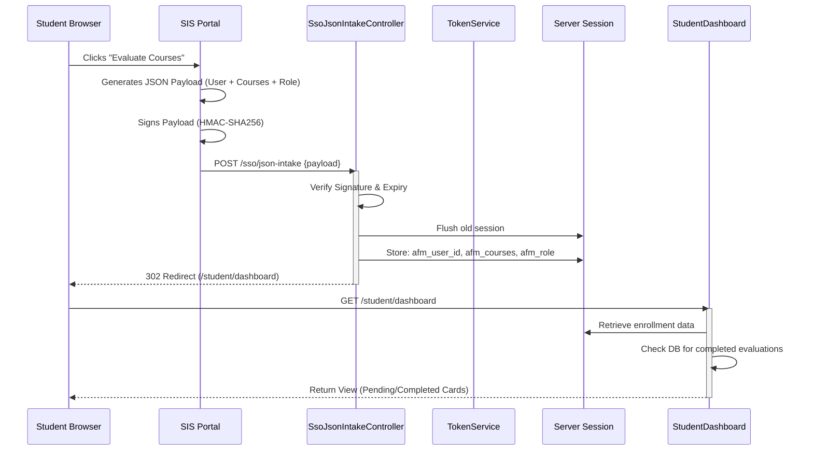

# System Flow Documentation

## 1. Student SSO & Access Flow
The Single Sign-On (SSO) process is the primary entry point for students. It relies on a trusted handshake between the SIS (Student Information System) and AFM.

### 1.1 Sequence Diagram (SSO via JSON Payload)

### 1.2 Detailed Steps
1.  **Transport:** Secure JSON POST request over HTTPS.
2.  **Validation:** `JsonPayloadVerifier` checks:
    - `iss` (Issuer) must be 'LIMU-SIS'.
    - `aud` (Audience) must be 'AFM'.
    - `exp` (Expiry) must be in the future.
    - `signature` must match the server-side re-computed hash.
3.  **Session Hydration:** If valid, the controller populates the Laravel session with the user's context (ID, Name, Enrolled Courses) and role.
4.  **Redirect:** The user is immediately redirected to their specific dashboard based on the `role` field.

## 2. QA Officer Access Flow
QA Officers access the system via a similar authenticated path or a direct dashboard login if configured (Production uses SSO).

### 2.1 Flow
1.  **Login:** Officer accesses `/qa` (or redirected from SSO).
2.  **Dashboard Load:**
    - System fetches aggregation stats from `responses` table.
    - System calculates live participation rates.
3.  **Reporting:**
    - Officer selects "Reports".
    - `QaReportingService` aggregates data on-demand.

## 3. Internal Feedback Lifecycle
Once a student is logged in, the feedback submission follows a strict state machine.

### 3.1 States
- **Pending:** Student is enrolled, but no record exists in `responses` table (or record exists with status `draft` - *future feature*).
- **Submitted:** Student POSTs data.
    - Answers saved to `response_items`.
    - Main record created in `responses`.
    - `status` set to `submitted`.
    - Row locked (no further edits).
- **Completed:** Student Dashboard reflects the submission; card moves to "History".

### 3.2 Error Paths
- **Invalid Token:** Redirect to SIS with error code.
- **Session Timeout:** If the session expires (120 mins), the user is redirected to the Landing Page which guides them back to SIS for a fresh handshake.
- **Double Submission:** Database unique compound index (`sis_student_id` + `course_reg_no` + `form_id`) prevents duplicate entries at the database level.
